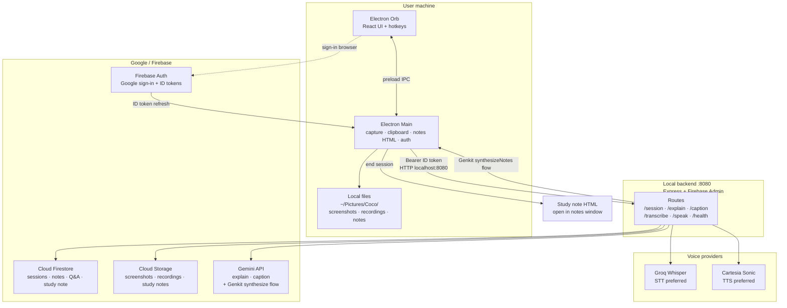

# Coco — architecture

Clear view of how the orb, local API, Google services, and voice providers connect.

## Layers

| Layer | Role |
|--------|------|
| **Orb (frontend)** | UI, PTT / Remember mic, commands |
| **Electron main** | Screenshots / recording, clipboard notes, session timeline, opens notes |
| **Backend `:8080`** | Auth-gated API; holds provider keys |
| **Genkit** | `synthesizeNotes` flow for end-of-session study notes (Gemini under the hood) |
| **Gemini** | Explain, image / recording captions; model used by Genkit synthesize |
| **Groq / Cartesia** | Speech in / speech out |
| **Firestore + GCS** | When signed in: session docs, notes/Q&A events, study-note markdown (Firestore); screenshot + recording blobs + `study-note.md` (GCS) |
| **Local disk** | Always-available captures + final HTML note (works offline / unsigned-in) |

## Typical flows

1. **Explain:** copy text → main → `POST /explain` → Gemini → speak via Cartesia  
2. **Remember:** mic → `POST /transcribe` (Groq) → save as session note → Firestore when signed in  
3. **Recording:** WebM local + (signed in) GCS upload + Firestore event  
4. **End session:** timeline → `POST /session/synthesize` → **Genkit `synthesizeNotes` flow** → Gemini markdown → local HTML pack + (signed in) Firestore fields + GCS `study-note.md`  

Optional Deepgram STT/TTS is used only if Groq/Cartesia are unset or fail.
